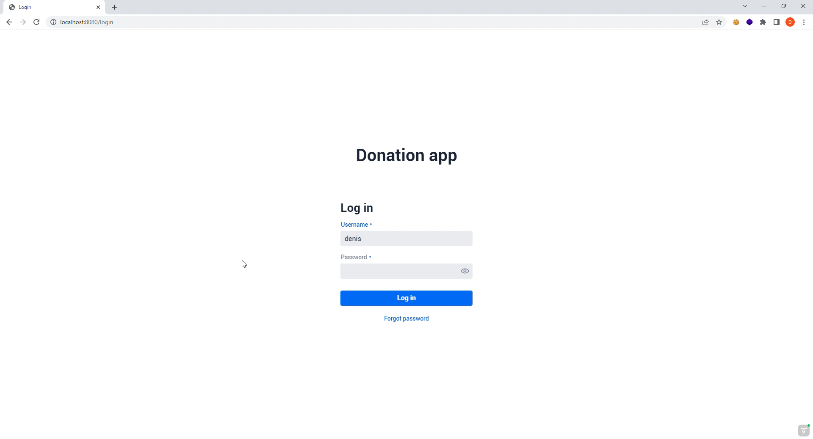
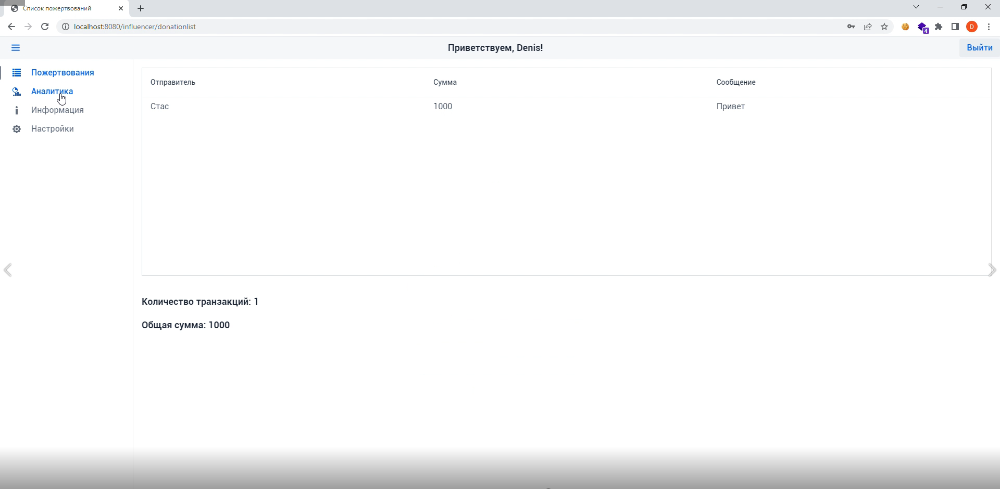
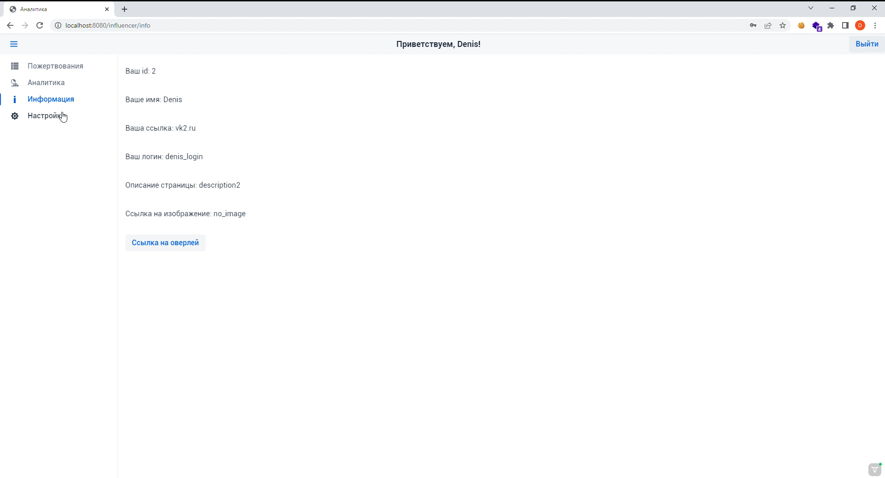
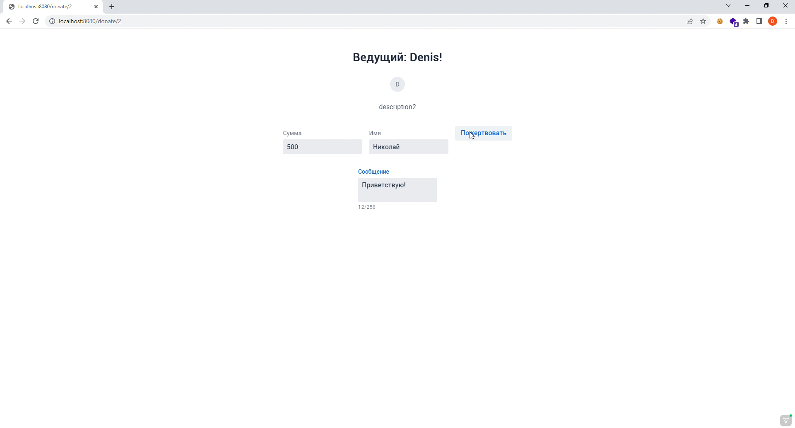

# DonationApp
Приложение для сбора пожертвований, было начато в рамках хакатона Hack&Change.  
## Описание
Приложение для сбора пожертвований во время прямых трансляций и вне, 
своеобразная попытка сделать аналог Donation Alerts.  
## Функционал
### Для стримера
- Просмотр списка всех донатов
- Просмотр аналитики (максимальный донат и самый щедрый жертвователь)
- Просмотр информации о себе
- Использование оверлея (донаты в реальном времени)
### Для зрителя
- Отправка пожертвований
  - с указанием своего имени
  - с указанием суммы
  - с комментарием
## Настройка
Настройки производятся в файле
```
src/main/resources/application.properties
```
Параметры:  

| Параметр                   |               Смысл               |
|----------------------------|:---------------------------------:|
| site.name                  |         Адрес корня сайта         |
| spring.datasource.url      |   Адрес базы данных Postgresql    |
| spring.datasource.username |        Имя пользователя БД        |
| spring.datasource.password |        Пароль пользователя        |
| spring.jpa.generate-ddl    | Флаг, разрешает генерацию таблицы |

## Стек
- Vaadin
- Spring Boot
- Spring Security
- Spring Data JPA
- Spring MVC
- Lombok
- PostgreSQL
- Docker
## Скрины
Главный экран:  

Экран входа:  

Список донатов:  

Окно информации:  

Окно доната:
